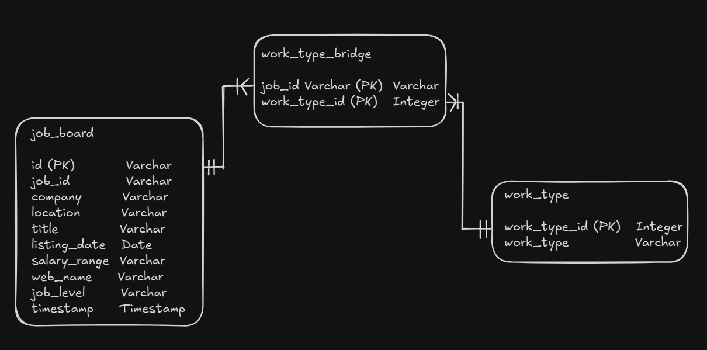
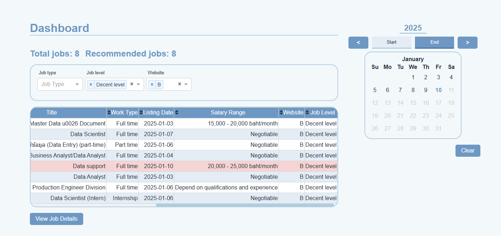
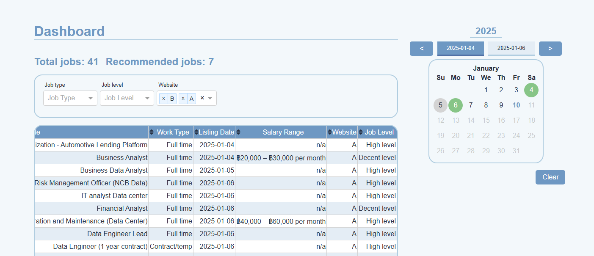

# Job Board Data Collection and Dashboard

A Python-based system for collecting job listings data from multiple job board websites, storing it in a database, and visualizing it through a web dashboard.

## Features

- Collects job listings from multiple job board websites.
- Stores job data in SQLite database.
- Web dashboard for visualizing and filtering job data.
- Logging system for tracking data collection.

## Project Structure

- `dashboard/` - Dashboard web application using Dash.
- `db/` - Database models and configuration.
- `jobextractor/` - Job data collection modules.
- `logs/` - Application logs.
- `scheduler.py` - Scheduled job collection.
- `main.py` - Main application entry point.

## Requirements

- Python 3.11+
- Additional dependencies in `requirements.txt`

## Setup

1. Create Python virtual environment:

```sh
python -m venv venv
source venv/bin/activate
```

2. Install dependencies:

```sh
pip install -r requirements.txt
```

3. Configure environment variables:

```sh
export JOB_KEYWORD="some job title"

export WEB_A_URL="some job board website url"
export WEB_A_DETAIL_PATH="$WEB_A_URL/path to detail"
export WEB_A_NAME="website name"

export WEB_B_URL="some job board website url"
export WEB_B_DETAIL_PATH="$WEB_B_URL/path to detail"
export WEB_B_NAME="website name"
# For all website that scraped is mock-up.

export PYTHONPATH=$(pwd):$PYTHONPATH
# Add python path for use custom module.
```

## Usage

Set up time in `main.py`. Default time is every day at 3 pm.

- Run `main.py` to collect job data:

```sh
python main.py
```

Or use **Cron Job** for control schedule.

- Launch the dashboard:
  In the **Recommended Jobs** section, only jobs labeled as `Decent level` in the `Job level` will be counted.

```sh
python dashboard/app.py
```

- Access dashboard at http://localhost:8050 .
- Monitor activity log in `/logs` folder.

## Demo

- When the process of website scraping begins, the data will be stored according to the schema shown in the diagram below.



- Preview dashboard to provide information.



